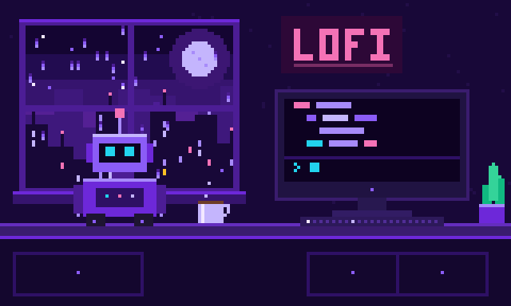
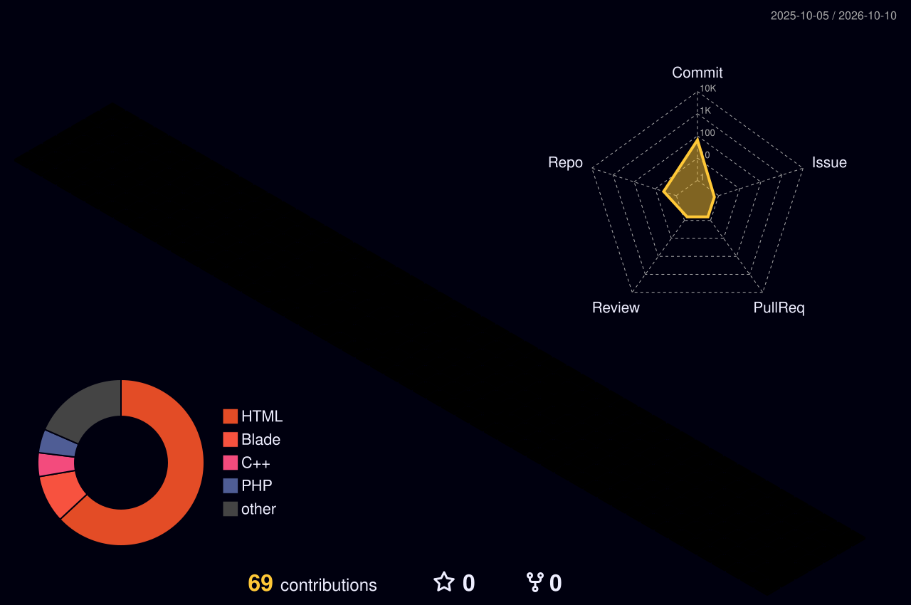

&nbsp;&nbsp;

 

## sobre mim

🇧🇷 Moro no interior de São Paulo e sou técnico em Desenvolvimento de Sistemas pelo SENAI. Minha trajetória é movida pela lógica e pela robótica, onde traduzo problemas complexos em soluções funcionais. Tenho experiência técnica e prática em competições de robótica, com a equipe **SESIMegaSnakesFTC**, usando Java em ecossistemas mobile de alto desempenho. Robótica e lógica não são só área de estudo pra mim: são paixão.

🇺🇸 I live in the interior of São Paulo, Brazil, and I hold a technical degree in Systems Development from SENAI. My path is driven by logic and robotics, turning complex problems into functional solutions. I have hands-on technical experience in robotics competitions with team **SESIMegaSnakesFTC**, using Java on high-performance mobile ecosystems. Robotics and logic are more than a field of study for me: they are a passion.

 

 

## stack

**languages**

&nbsp;&nbsp;&nbsp;
&nbsp;&nbsp;&nbsp;
&nbsp;&nbsp;&nbsp;
&nbsp;&nbsp;&nbsp;
&nbsp;&nbsp;&nbsp;
&nbsp;&nbsp;&nbsp;
&nbsp;&nbsp;&nbsp;
&nbsp;&nbsp;&nbsp;

 

**tools & frameworks**

&nbsp;&nbsp;&nbsp;
&nbsp;&nbsp;&nbsp;
&nbsp;&nbsp;&nbsp;
&nbsp;&nbsp;&nbsp;
&nbsp;&nbsp;&nbsp;

 

## atividade

  

 

## status

 

